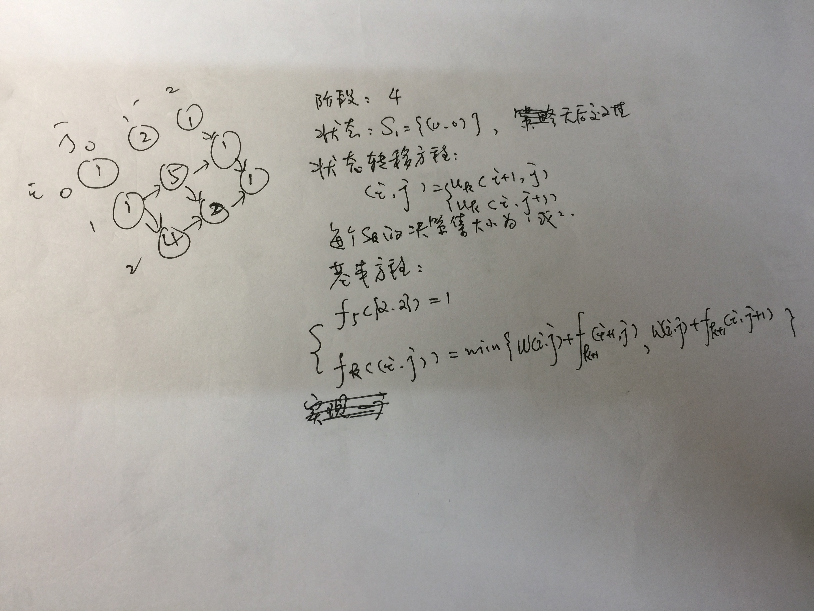

[最小路径和](https://leetcode-cn.com/problems/minimum-path-sum/)
==========  

+ 思路：  

+ 代码：  
```java
import java.util.ArrayDeque;
import java.util.Arrays;
import java.util.Scanner;

/**
 * @author Chris Chen
 * @date 2019/4/20 下午2:50
 */
public class MinPathSum {

    public static int getMin(int a, int b) {
        return a < b ? a : b;
    }

    public static int minPathSum(int[][] grid) {
        int m = grid.length;
        int n = grid[0].length;
        int k = m + n - 1;
        /*
        decision
         */

        class Point {
            int x;
            int y;

            public Point(int x, int y) {
                this.x = x;
                this.y = y;
            }

            public void setX(int x) {
                this.x = x;
            }

            public void setY(int y) {
                this.y = y;
            }
        }

        int[][] dir = {{-1, 0}, {0, -1}};

        int[][] f = new int[m + 5][n + 5];
        for (int i = 0; i < m + 5; i++) {
            Arrays.fill(f[i], 9999999);
        }
        boolean[][] flag = new boolean[m][n];
        for (int i = 0; i < m; i++) {

            Arrays.fill(flag[i], false);
        }


        f[m - 1][n - 1] = grid[m - 1][n - 1];
        flag[m - 1][n - 1] = true;

        ArrayDeque queue = new ArrayDeque();
        /*
        入队
         */
        Point point = new Point(m - 1, n - 1);
        queue.offer(point);
        while (!queue.isEmpty()) {
            point = (Point) queue.poll();
            for (int i = 0; i < 2; i++) {
                int tmpX = point.x + dir[i][0];
                int tmpY = point.y + dir[i][1];
                if (tmpX >= 0 && tmpX < m && tmpY >= 0 && tmpY < n && flag[tmpX][tmpY] == false) {
                    Point tmpPoint = new Point(tmpX, tmpY);
                    int a = grid[tmpPoint.x][tmpPoint.y] + f[tmpPoint.x + 1][tmpPoint.y];
                    int b = grid[tmpPoint.x][tmpPoint.y] + f[tmpPoint.x][tmpPoint.y + 1];
                    f[tmpPoint.x][tmpPoint.y] = getMin(a, b);
                    flag[tmpPoint.x][tmpPoint.y] = true;
                    queue.offer(tmpPoint);
                }
            }
        }
        return f[0][0];
    }

    public static void main(String[] args) {
        Scanner sc = new Scanner(System.in);
        while (sc.hasNext()) {

            int m = sc.nextInt();
            int n = sc.nextInt();
            int[][] grid = new int[m][n];
            for (int i = 0; i < m; i++) {
                for (int j = 0; j < n; j++) {
                    grid[i][j] = sc.nextInt();
                }
            }
            int ans = minPathSum(grid);
            System.out.println(ans);
        }
    }
}

```
