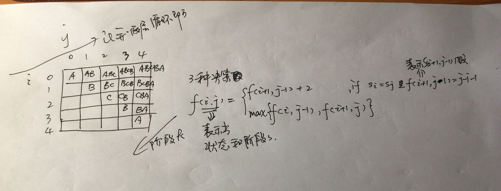

[最长回文子串](https://leetcode-cn.com/problems/longest-palindromic-substring/)
===========  
+ 思路：  

+ 代码：  
```java
/**
 * @author Chris Chen
 * @date 2019/4/21 下午1:01
 */
public class LongestPalindromicSubstring {

    public static int max(int a, int b){
        return a > b?a:b;
    }

    public static String longestPalindrome(String s) {
        String ans =null;
        int len = s.length();
        if(len == 0){
            return "";
        }
        int[][] f = new int[len][len];
        for(int i=0;i<len;i++){
            for(int j=0;j<len;j++){
                if(i==j){
                    f[i][j]=1;
                }else {
                    f[i][j]=0;
                }
            }
        }
        class Point {
            int x;
            int y;

            public Point(int x, int y) {
                this.x = x;
                this.y = y;
            }
            public void setXY(int x,int y){
                this.x =x;
                this.y = y;
            }
        }
        Point point = new Point(0,0);
        for(int k=1;k<len;k++){
            for(int i=0;i<len-k;i++){
                int j= i+k;
                if(s.charAt(i)==s.charAt(j) && f[i+1][j-1]==j-i-1){
                    f[i][j]=2+f[i+1][j-1];
                }else{
                    f[i][j]=max(f[i][j-1],f[i+1][j]);
                }
                if(f[i][j]>f[point.x][point.y]){
                    point.setXY(i,j);
                }
            }
        }
        ans = s.substring(point.x,point.y+1);
        return ans;
    }
    public static void main(String[] args) {
        String s = "abcda";
        System.out.println(longestPalindrome(s));
    }
}

```